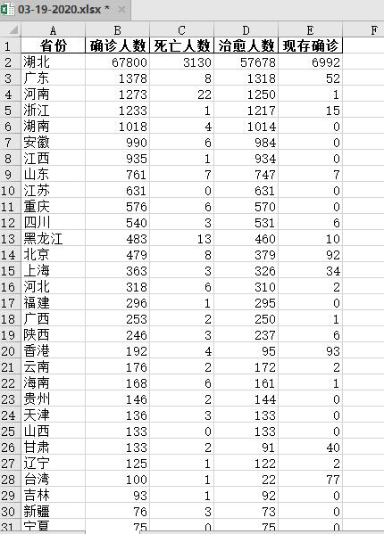
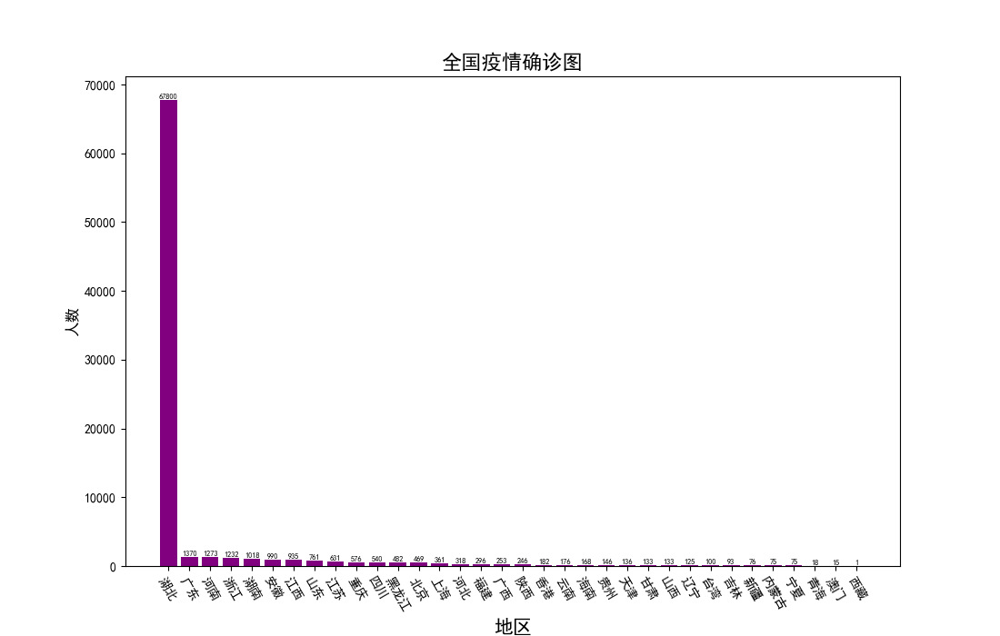
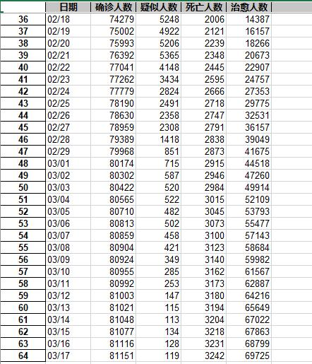
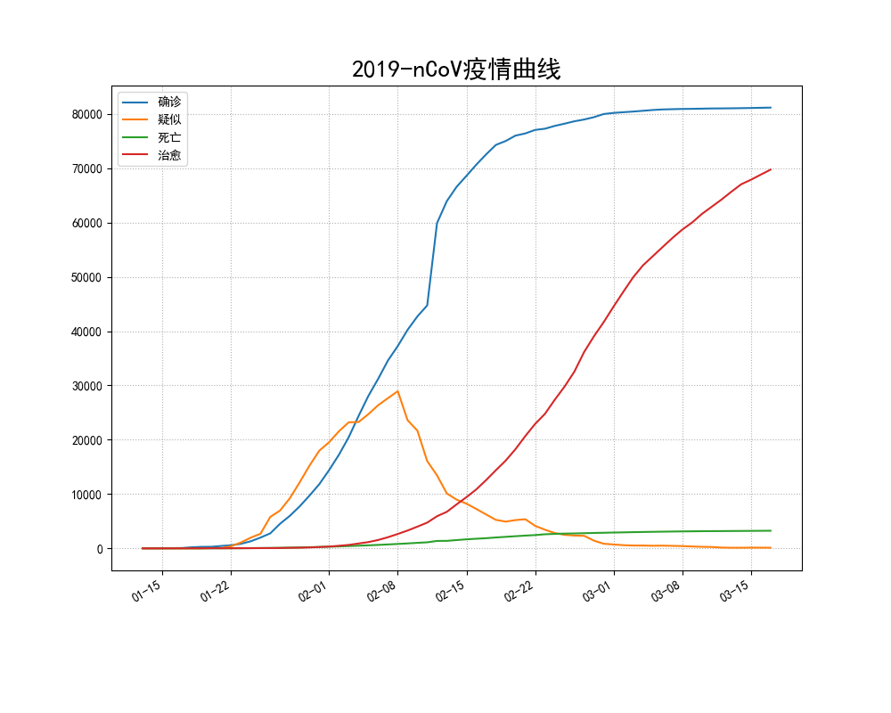

# **python爬取腾讯实时疫情数据并导出为.xlsx文件作图** #

爬取网址：https://news.qq.com/zt2020/page/feiyan.htm#/

2019cov.py文件实时爬取全国各省的确诊人数，死亡人数，治愈人数，现存确诊人数。导出为time.xlsx格式，并用matplotlib.pyplot绘制全国各省累计确诊人数。

 

2019nCoV.py爬取全国每天的确诊，疑似，治愈，死亡人数，数据处理导出为time.xlsx格式，用matplotlib库绘制疫情曲线。

 

full_earth.py爬取全球每个国家确诊人数，死亡人数，治愈人数，现存确诊人数，并导出到time.xlsx的earth表中。

daily_earth.py爬取全球每个国家每天的统计情况。并导出成表。
