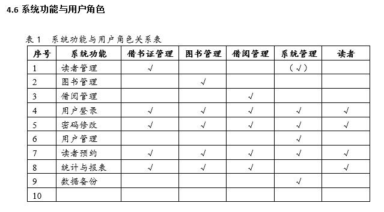
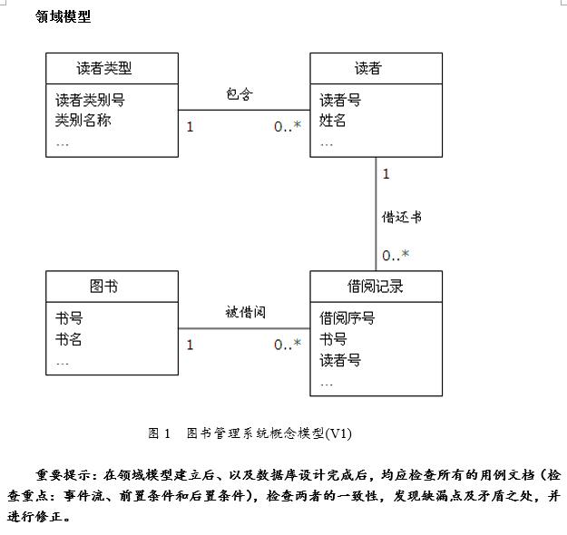
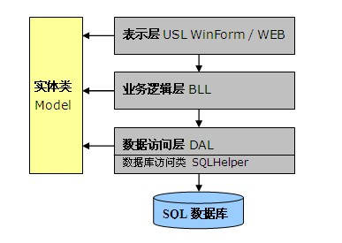

#**图书管理系统**

## 读者管理  
读者管理即借书证管理，包括的业务（即用例）有：办理借书证、借书证变更、借书证挂失*、解除挂失*、补办借书证*、注销借书证*、批量办理新生借书证*等。  
借书证（读者）可分为2种类别：教师、学生。  
借书证（教师）=借书证号、姓名、性别、所在单位、办证日期、照片等。  
借书证（学生）=借书证号、学号、姓名、性别、专业、班级、办证日期、有效期、照片等。其中，有效期由学生类别决定，本科生4年、专科生3年、硕士生3年等。  
相关业务规则：(1)读者凭借书证借书；(2)教师最多借书12本，借书期限最长为60天，可续借2次；学生最多借书8本，借书期限最长为30天，可续借1次；(3)处于挂失、注销状态的读者不能借书；(4)未归还图书者不能注销其借书证。  
分析：增加读者类别概念，统一并简化读者信息，采用教师属性项，而学生可在所在单位填写班级，学生特有读者信息可留待以后的开发周期处理。可得到2个概念：读者、读者类别。  
读者=借书证号、姓名、性别、所在单位、读者类别、办证日期、照片等。（另可加：电话、邮箱等）
读者类别=读者类别号、类别名称、可借书本数、可借书天数、可续借次数。  
## 图书管理
包括业务（用例）：图书编目*、新书入库、图书信息维护、图书变卖与销毁处理*等。
图书信息=书号、书名、作者、出版社、出版日期、ISBN、分类号、语言、页数、单价、内容简介、图书封面、图书状态等；（图书状态包括：在馆、借出、遗失、变卖、销毁）  
## 用户登录与用户管理 
包括用例：用户登录、密码修改、用户管理*，为本系统的基础和主要功能。
用户包括2类：读者、管理员。其中，管理员用户权限是4种角色的组合：借书证管理、图书管理、借阅管理、系统管理；系统管理员负责所有管理员用户及其权限的管理，借书证管理员负责读者管理（即借书证管理）。  


## 领域概念小结  
读者=读者号（借书证号）、姓名、性别、所在单位、电话、邮箱地址、办证日期、照片、借书证状态、已借书数量、密码、管理角色。（借书证状态：有效、挂失、注销）   
读者类别=读者类别号、读者类别名称、可借书数量、可借书天数、可续借次数，罚款率，证件有效期。
图书=书号、书名、作者、出版社、出版日期、ISBN、分类号、语言、页数、单价、内容简介、图书封面、图书状态。（图书状态包括：在馆、借出、遗失、销毁、卖出）  
借阅信息=借书顺序号、读者号、书号、借书操作员、借书日期、应还日期、续借次数、还书操作员、还书日期，超期天数、应罚款金额、实际罚款金额。  
  

1. 读者类别表(TB_ReaderType)
<table>
   <tr>
      <td>序号</td>
      <td>字段名</td>
      <td>数据类型</td>
      <td>说明</td>
   </tr>
   <tr>
      <td>1</td>
      <td>rdType</td>
      <td>SmallInt</td>
      <td>读者类别【主键】</td>
   </tr>
   <tr>
      <td>2</td>
      <td>rdTypeName</td>
      <td>Nvarchar(20)</td>
      <td>读者类别名称【唯一、非空】</td>
   </tr>
   <tr>
      <td>3</td>
      <td>CanLendQty</td>
      <td>Int</td>
      <td>可借书数量</td>
   </tr>
   <tr>
      <td>4</td>
      <td>CanLendDay</td>
      <td>Int</td>
      <td>可借书天数</td>
   </tr>
   <tr>
      <td>5</td>
      <td>CanContinueTimes</td>
      <td>Int</td>
      <td>可续借的次数</td>
   </tr>
   <tr>
      <td>6</td>
      <td>PunishRate</td>
      <td>Float</td>
      <td>罚款率（元/天）</td>
   </tr>
   <tr>
      <td>7</td>
      <td>DateValid</td>
      <td>SmallInt</td>
      <td>证书有效期（年）【非空，0表示永久有效】</td>
   </tr>
</table>
2. 读者信息表(TB_Reader)  

序号|字段名| 数据类型|说明
|  ----  | ----  |  ----  |----
1|rdID|Int|读者编号/借书证号【主键】
2	|rdName|	nvarchar(20)	|读者姓名
3	|rdSex| nchar(1)	|性别，男/女
4	|rdType|	SmallInt|	读者类别【外键TB_ReaderType】【非空】
5	|rdDept|	nvarchar (20)|	单位代码/单位名称
6	|rdPhone	|nvarchar(25)|	电话号码
7	|rdEmail|	nvarchar(25)|	电子邮箱
8	|rdDateReg	|datetime|	读者登记日期/办证日期
9	|rdPhoto|	imag|	读者照片
10	|rdStatus	|nchar(2)|	证件状态，3个：有效、挂失、注销
11	|rdBorrowQty|	Int|	已借书数量(缺省值0)
12|	rdPwd|	nvarchar (20)|	读者密码(初值123)，可加密存储
13	|rdAdminRoles|	SmallInt|	管理角色，0-读者、1-借书证管理、2-图书管理、4-借阅管理、8-系统管理，可组合
3. 图书信息表(TB_Book)

| 序号          | 字段名         | 数据类型            | 说明                          |
|-------------|-------------|-----------------|-----------------------------|
| 1           | bkID        | Int             | 图书序号【标识列，主键】                |
| 2           | bkCode      | Nvarchar \(20\) | 图书编号或条码号（前文中的书号）            |
| 3           | bkName      | Nvarchar\(50\)  | 书名                          |
| 4           | bkAuthor    | Nvarchar\(30\)  | 作者                          |
| 5           | bkPress     | Nvarchar\(50\)  | 出版社                         |
| 6           | bkDatePress | datetime        | 出版日期                        |
| 7           | bkISBN      | Nvarchar \(15\) | ISBN书号                      |
| 8           | bkCatalog   | Nvarchar\(30\)  | 分类号（如：TP316\-21/123）        |
| 9           | bkLanguage  | SmallInt        | 语言，0\-中文，1\-英文，2\-日文，3\-俄文，| 4\-德文，5\-法文 |
| 10          | bkPages     | Int             | 页数                          |
| 11          | bkPrice     | Money           | 价格                          |
| 12          | bkDateIn    | DateTime        | 入馆日期                        |
| 13          | bkBrief     | Text            | 内容简介                        |
| 14          | bkCover     | image           | 图书封面照片                      |
| 15          | bkStatus    | NChar\(2\)      | 图书状态，在馆、借出、遗失、变卖、销毁         |
4. 借阅信息表(TB_Borrow)

| 序号 | 字段名             | 数据类型            | 说明                 |
|----|-----------------|-----------------|--------------------|
| 1  | BorrowID        | Numeric\(12,0\) | 借书顺序号【主键】          |
| 2  | rdID            | Int             | 读者序号【外键TB\_Reader】 |
| 3  | bkID            | Int             | 图书序号【外键TB\_Book】   |
| 4  | ldContinueTimes | Int             | 续借次数（第一次借时，记为0）    |
| 5  | ldDateOut       | DateTime        | 借书日期               |
| 6  | ldDateRetPlan   | DateTime        | 应还日期               |
| 7  | ldDateRetAct    | DateTime        | 实际还书日期             |
| 8  | ldOverDay       | Int             | 超期天数               |
| 9  | ldOverMoney     | Money           | 超期金额（应罚款金额）        |
| 10 | ldPunishMoney   | Money           | 罚款金额               |
| 11 | lsHasReturn     | Bit             | 是否已经还书，缺省为0\-未还    |
| 12 | OperatorLend    | Nvarchar\(20\)  | 借书操作员              |
| 13 | OperatorRet     | Nvarchar\(20\)  | 还书操作员              |


##领域概念小结

采用三层体系结构，即表示层、业务逻辑层和数据访问层，如图2所示，图中箭头表示调用和依赖关系。  
  
表示层（USL）：也称UI，提供交互式界面，形式：WinForm或HTML Web界面。
业务逻辑层（BLL）：实现业务功能，为表示层提供服务，形式：类库。  
数据访问层（DAL）：实现数据访问功能（如数据库、文件等数据的读取、保存和更新），为业务逻辑层提供服务，形式：类库。微软公布的SQLHelper类提供了对SQL Server数据库的一般访问方法（JAVA有类似的类或组件）。  
实体类(Model)：描述一个业务实体的类，也即应用系统所涉及的业务对象。对数据库来讲，每个数据表对应于一个实体类，数据表的每个字段对应于类的一个属性。  
表示层、业务逻辑层、数据访问层都依赖于业务实体。各层之间数据的传递主要是实体对象，业务信息封装在实体对象中。  

##搭建三层架构解决方案
创建JAVA应用程序解决方案，包括4个项目：BookManage（Windows窗口应用程序）、BookManage.Model（类库）、BookManage.DAL（类库）、BookManage.BLL（类库）。
在Eclipse中创建新的Java项目，命名为LibraryMIS，包括4个包：edu.yangtzeu.lmis.gui（Java窗口应用程序）、edu.yangtzeu.lmis.dal（数据访问层），edu.yangtzeu.lmis.model（实体类集合）、edu.yangtzeu.lmis.bll（业务功能集合）。

| 层       | 类名               | 说明                                         |
|---------|------------------|--------------------------------------------|
| 实体类模块   |
| （Model） | ReaderType       | 读者类型实体类                                    |
|         | Reader           | 读者实体类                                      |
|         | Book             | 图书实体类                                      |
|         | Borrow           | 借阅记录实体类                                    |
| 数据访问层   |
| （DAL）   | ReaderTypeDAL    | 读者类型数据表访问类（插、删、改、查、存储过程等）                  |
|         | ReaderDAL        | 读者数据表访问类（插、删、改、查、存储过程等）                    |
|         | BookDAL          | 图书数据表访问类（插、删、改、查、存储过程等）                    |
|         | BorrowDAL        | 借阅数据表访问类（插、删、改、查、存储过程等）                    |
|         | SQLHelper        | 微软提供的对SQL Server数据库进行访问的通用类                |
| 业务逻辑层   |
| （BLL）   | ReaderTypeAdmin  | 读者类型管理类，实现插、删、改、查等信息维护操作。                  |
|         | ReaderAdmin      | 读者管理类，实现借书证办理、变更、补办、挂失、解除挂失、注销等用例中的各种系统操作。 |
|         | BookAdmin        | 图书管理类，实现图书管理各用例中的系统操作                      |
|         | BorrowAdmin      | 借阅管理类，实现借书、还书、续借等用例中的系统操作。                 |
|         | UserAdmin        | 用户管理类，                                     |
| 表示层     |
| （UI）    | Login            | 登录窗口类                                      |
|         | Main             | 程序主窗口类，含菜单、工具栏、状态栏等                        |
|         | readerManagePane | 读者管理窗口类                                    |
|         | BorrowPane       | 借书窗口类                                      |
|         | …                |                                            |

SQLHelper.java

```SQLHelper.java
package edu.yangtzeu.lmis.dal;
import java.sql.Connection;
import java.sql.DriverManager;
import java.sql.PreparedStatement;
import java.sql.ResultSet;
import java.sql.SQLException;
import java.sql.Statement;
import java.util.logging.Level;
import java.util.logging.Logger;
public class SQLHelper {
	/**
	 * 驱动
	 */
	// public static String driver =
	// "com.microsoft.jdbc.sqlserver.SQLServerDriver";
	/**
	 * 连接字符串
	 */
	public static String url = "jdbc:sqlserver://localhost:1433;DatabaseName=Library";

	/**
	 * 用户名
	 */
	public static String user = "LibraryAdmin";
	/**
	 * 密码
	 */
	public static String password = "1234";

	/**
	 * 不允许实例化该类
	 */
	private SQLHelper() {
	}

	/**
	 * 获取一个数据库连接 通过设置类的 driver / url / user / password 这四个静态变量来 设置数据库连接属性
	 * 
	 * @return 数据库连接
	 */
	public static Connection getConnection() {
		// try {
		// // 获取驱动,这里使用的是 sqljdbc_1.2.2828.100_chs.exe,不同版本的驱动,语句有所不同
		// Class.forName(driver);
		// } catch (ClassNotFoundException ex) {
		// Logger.getLogger(SQLHelper.class.getName()).log(Level.SEVERE, null,
		// ex);
		// }
		try {
			return DriverManager.getConnection(url, user, password);
		} catch (SQLException ex) {
			Logger.getLogger(SQLHelper.class.getName()).log(Level.SEVERE, null,
					ex);
			return null;
		}
	}

	/**
	 * 获取一个 Statement 该 Statement 已经设置数据集 可以滚动,可以更新
	 * 
	 * @return 如果获取失败将返回 null,调用时记得检查返回值
	 */
	public static Statement getStatement() {
		Connection conn = getConnection();
		if (conn == null) {
			return null;
		}
		try {
			return conn.createStatement(ResultSet.TYPE_SCROLL_SENSITIVE,
					ResultSet.CONCUR_UPDATABLE);
			// 设置数据集可以滚动,可以更新
		} catch (SQLException ex) {
			Logger.getLogger(SQLHelper.class.getName()).log(Level.SEVERE, null,
					ex);
			close(conn);
		}
		return null;
	}

	/**
	 * 获取一个 Statement 该 Statement 已经设置数据集 可以滚动,可以更新
	 * 
	 * @param conn
	 *            数据库连接
	 * @return 如果获取失败将返回 null,调用时记得检查返回值
	 */
	public static Statement getStatement(Connection conn) {
		if (conn == null) {
			return null;
		}
		try {
			return conn.createStatement(ResultSet.TYPE_SCROLL_SENSITIVE,
					ResultSet.CONCUR_UPDATABLE);
			// 设置数据集可以滚动,可以更新
		} catch (SQLException ex) {
			Logger.getLogger(SQLHelper.class.getName()).log(Level.SEVERE, null,
					ex);
			return null;
		}
	}

	/**
	 * 获取一个带参数的 PreparedStatement 该 PreparedStatement 已经设置数据集 可以滚动,可以更新
	 * 
	 * @param cmdText
	 *            需要 ? 参数的 SQL 语句
	 * @param cmdParams
	 *            SQL 语句的参数表
	 * @return 如果获取失败将返回 null,调用时记得检查返回值
	 */
	public static PreparedStatement getPreparedStatement(String cmdText,
			Object... cmdParams) {
		Connection conn = getConnection();
		if (conn == null) {
			return null;
		}
		PreparedStatement pstmt = null;
		try {
			pstmt = conn
					.prepareStatement(cmdText, ResultSet.TYPE_SCROLL_SENSITIVE,
							ResultSet.CONCUR_UPDATABLE);
			int i = 1;
			for (Object item : cmdParams) {
				pstmt.setObject(i, item);
				i++;
			}
		} catch (SQLException e) {
			e.printStackTrace();
			close(conn);
		}
		return pstmt;
	}

	/**
	 * 获取一个带参数的 PreparedStatement 该 PreparedStatement 已经设置数据集 可以滚动,可以更新
	 * 
	 * @param conn
	 *            数据库连接
	 * @param cmdText
	 *            需要 ? 参数的 SQL 语句
	 * @param cmdParams
	 *            SQL 语句的参数表
	 * @return 如果获取失败将返回 null,调用时记得检查返回值
	 */
	public static PreparedStatement getPreparedStatement(Connection conn,
			String cmdText, Object... cmdParams) {
		if (conn == null) {
			return null;
		}
		PreparedStatement pstmt = null;
		try {
			pstmt = conn
					.prepareStatement(cmdText, ResultSet.TYPE_SCROLL_SENSITIVE,
							ResultSet.CONCUR_UPDATABLE);
			int i = 1;
			for (Object item : cmdParams) {
				pstmt.setObject(i, item);
				i++;
			}
		} catch (SQLException e) {
			e.printStackTrace();
			close(pstmt);
		}
		return pstmt;
	}

	/**
	 * 执行 SQL 语句,返回结果为整型 主要用于执行非查询语句
	 * 
	 * @param cmdText
	 *            SQL 语句
	 * @return 非负数:正常执行; -1:执行错误; -2:连接错误
	 */
	public static int ExecSql(String cmdText) {
		Statement stmt = getStatement();
		if (stmt == null) {
			return -2;
		}
		int i;
		try {
			i = stmt.executeUpdate(cmdText);
		} catch (SQLException ex) {
			Logger.getLogger(SQLHelper.class.getName()).log(Level.SEVERE, null,
					ex);
			i = -1;
		}
		closeConnection(stmt);
		return i;
	}

	/**
	 * 执行 SQL 语句,返回结果为整型 主要用于执行非查询语句
	 * 
	 * @param cmdText
	 *            SQL 语句
	 * @return 非负数:正常执行; -1:执行错误; -2:连接错误
	 */
	public static int ExecSql(Connection conn, String cmdText) {
		Statement stmt = getStatement(conn);
		if (stmt == null) {
			return -2;
		}
		int i;
		try {
			i = stmt.executeUpdate(cmdText);
		} catch (SQLException ex) {
			Logger.getLogger(SQLHelper.class.getName()).log(Level.SEVERE, null,
					ex);
			i = -1;
		}
		close(stmt);
		return i;
	}

	/**
	 * 执行 SQL 语句,返回结果为整型 主要用于执行非查询语句
	 * 
	 * @param cmdText
	 *            需要 ? 参数的 SQL 语句
	 * @param cmdParams
	 *            SQL 语句的参数表
	 * @return 非负数:正常执行; -1:执行错误; -2:连接错误
	 */
	public static int ExecSql(String cmdText, Object... cmdParams) {
		PreparedStatement pstmt = getPreparedStatement(cmdText, cmdParams);
		if (pstmt == null) {
			return -2;
		}
		int i;
		try {
			i = pstmt.executeUpdate();
		} catch (SQLException ex) {
			Logger.getLogger(SQLHelper.class.getName()).log(Level.SEVERE, null,
					ex);
			i = -1;
		}
		closeConnection(pstmt);
		return i;
	}

	/**
	 * 执行 SQL 语句,返回结果为整型 主要用于执行非查询语句
	 * 
	 * @param conn
	 *            数据库连接
	 * @param cmdText
	 *            需要 ? 参数的 SQL 语句
	 * @param cmdParams
	 *            SQL 语句的参数表
	 * @return 非负数:正常执行; -1:执行错误; -2:连接错误
	 */
	public static int ExecSql(Connection conn, String cmdText,
			Object... cmdParams) {
		PreparedStatement pstmt = getPreparedStatement(conn, cmdText, cmdParams);
		if (pstmt == null) {
			return -2;
		}
		int i;
		try {
			i = pstmt.executeUpdate();
		} catch (SQLException ex) {
			Logger.getLogger(SQLHelper.class.getName()).log(Level.SEVERE, null,
					ex);
			i = -1;
		}
		close(pstmt);
		return i;
	}

	/**
	 * 返回结果集的第一行的一列的值,其他忽略
	 * 
	 * @param cmdText
	 *            SQL 语句
	 * @return
	 */
	public static Object ExecScalar(String cmdText) {
		ResultSet rs = getResultSet(cmdText);
		Object obj = buildScalar(rs);
		closeConnection(rs);
		return obj;
	}

	/**
	 * 返回结果集的第一行的一列的值,其他忽略
	 * 
	 * @param conn
	 *            数据库连接
	 * @param cmdText
	 *            SQL 语句
	 * @return
	 */
	public static Object ExecScalar(Connection conn, String cmdText) {
		ResultSet rs = getResultSet(conn, cmdText);
		Object obj = buildScalar(rs);
		closeEx(rs);
		return obj;
	}

	/**
	 * 返回结果集的第一行的一列的值,其他忽略
	 * 
	 * @param cmdText
	 *            需要 ? 参数的 SQL 语句
	 * @param cmdParams
	 *            SQL 语句的参数表
	 * @return
	 */
	public static Object ExecScalar(String cmdText, Object... cmdParams) {
		ResultSet rs = getResultSet(cmdText, cmdParams);
		Object obj = buildScalar(rs);
		closeConnection(rs);
		return obj;
	}

	/**
	 * 返回结果集的第一行的一列的值,其他忽略
	 * 
	 * @param conn
	 *            数据库连接
	 * @param cmdText
	 *            需要 ? 参数的 SQL 语句
	 * @param cmdParams
	 *            SQL 语句的参数表
	 * @return
	 */
	public static Object ExecScalar(Connection conn, String cmdText,
			Object... cmdParams) {
		ResultSet rs = getResultSet(conn, cmdText, cmdParams);
		Object obj = buildScalar(rs);
		closeEx(rs);
		return obj;
	}

	/**
	 * 返回一个 ResultSet
	 * 
	 * @param cmdText
	 *            SQL 语句
	 * @return
	 */
	public static ResultSet getResultSet(String cmdText) {
		Statement stmt = getStatement();
		if (stmt == null) {
			return null;
		}
		try {
			return stmt.executeQuery(cmdText);
		} catch (SQLException ex) {
			Logger.getLogger(SQLHelper.class.getName()).log(Level.SEVERE, null,
					ex);
			closeConnection(stmt);
		}
		return null;
	}

	/**
	 * 返回一个 ResultSet
	 * 
	 * @param conn
	 * @param cmdText
	 *            SQL 语句
	 * @return
	 */
	public static ResultSet getResultSet(Connection conn, String cmdText) {
		Statement stmt = getStatement(conn);
		if (stmt == null) {
			return null;
		}
		try {
			return stmt.executeQuery(cmdText);
		} catch (SQLException ex) {
			Logger.getLogger(SQLHelper.class.getName()).log(Level.SEVERE, null,
					ex);
			close(stmt);
		}
		return null;
	}

	/**
	 * 返回一个 ResultSet
	 * 
	 * @param cmdText
	 *            需要 ? 参数的 SQL 语句
	 * @param cmdParams
	 *            SQL 语句的参数表
	 * @return
	 */
	public static ResultSet getResultSet(String cmdText, Object... cmdParams) {
		PreparedStatement pstmt = getPreparedStatement(cmdText, cmdParams);
		if (pstmt == null) {
			return null;
		}
		try {
			return pstmt.executeQuery();
		} catch (SQLException ex) {
			Logger.getLogger(SQLHelper.class.getName()).log(Level.SEVERE, null,
					ex);
			closeConnection(pstmt);
		}
		return null;
	}

	/**
	 * 返回一个 ResultSet
	 * 
	 * @param conn
	 *            数据库连接
	 * @param cmdText
	 *            需要 ? 参数的 SQL 语句
	 * @param cmdParams
	 *            SQL 语句的参数表
	 * @return
	 */
	public static ResultSet getResultSet(Connection conn, String cmdText,
			Object... cmdParams) {
		PreparedStatement pstmt = getPreparedStatement(conn, cmdText, cmdParams);
		if (pstmt == null) {
			return null;
		}
		try {
			return pstmt.executeQuery();
		} catch (SQLException ex) {
			Logger.getLogger(SQLHelper.class.getName()).log(Level.SEVERE, null,
					ex);
			close(pstmt);
		}
		return null;
	}

	public static Object buildScalar(ResultSet rs) {
		if (rs == null) {
			return null;
		}
		Object obj = null;
		try {
			if (rs.next()) {
				obj = rs.getObject(1);
			}
		} catch (SQLException ex) {
			Logger.getLogger(SQLHelper.class.getName()).log(Level.SEVERE, null,
					ex);
		}
		return obj;
	}

	/**
	 * 获取一个具有更新功能的数据模型 如果只要读取数据，就不要用它了
	 * 
	 * @param cmdText
	 *            能返回一个数据集的查询SQL 语句
	 * @return 表格数据模型
	 * 
	 * 
	 *         DataSet 没有找到在哪个包中,因为暂时用不到所以省略此方法
	 * 
	 *         public static DataSet getDataSet(String cmdText) { Statement stmt
	 *         = getStatement(); DataSet dbc = new DataSet(); if (stmt == null)
	 *         { dbc.code = -2; return dbc; } try { // 查询语句 dbc.rs =
	 *         stmt.executeQuery(cmdText); dbc.model = buildTableModel(dbc.rs);
	 *         dbc.code = dbc.model.getRowCount(); } catch (SQLException ex) {
	 *         Logger.getLogger(SQLHelper1.class.getName()).log(Level.SEVERE,
	 *         null, ex); dbc.code = -1; } return dbc; }
	 */

	/**
	 * 获取一个具有更新功能的数据模型 如果只要读取数据，就不要用它了
	 * 
	 * @param conn
	 *            数据库连接
	 * @param cmdText
	 *            能返回一个数据集的查询SQL 语句
	 * @return 表格数据模型
	 * 
	 *         同上一个方法
	 * 
	 *         public static DataSet getDataSet(Connection conn, String cmdText)
	 *         { Statement stmt = getStatement(conn); DataSet dbc = new
	 *         DataSet(); if (stmt == null) { dbc.code = -2; return dbc; } try {
	 *         // 查询语句 dbc.rs = stmt.executeQuery(cmdText); dbc.model =
	 *         buildTableModel(dbc.rs); dbc.code = dbc.model.getRowCount(); }
	 *         catch (SQLException ex) {
	 *         Logger.getLogger(SQLHelper1.class.getName()).log(Level.SEVERE,
	 *         null, ex); dbc.code = -1; } return dbc; }
	 */
	/**
	 * 获取一个具有更新功能的数据模型 如果只要读取数据，就不要用它了
	 * 
	 * @param cmdText
	 *            需要 ? 参数的 SQL 语句
	 * @param cmdParams
	 *            SQL 语句的参数表
	 * @return 表格数据模型
	 * 
	 * 
	 *         同上一个方法 *
	 * 
	 * 
	 *         public static DataSet getDataSet(String cmdText, Object...
	 *         cmdParams) { PreparedStatement pstmt =
	 *         getPreparedStatement(cmdText, cmdParams); DataSet dbc = new
	 *         DataSet(); if (pstmt == null) { dbc.code = -2; return dbc; } try
	 *         { // 查询语句 dbc.rs = pstmt.executeQuery(); dbc.model =
	 *         buildTableModel(dbc.rs); dbc.code = dbc.model.getRowCount(); }
	 *         catch (SQLException ex) {
	 *         Logger.getLogger(SQLHelper1.class.getName()).log(Level.SEVERE,
	 *         null, ex); dbc.code = -1; } return dbc; }
	 */
	/**
	 * 获取一个具有更新功能的数据模型 如果只要读取数据，就不要用它了
	 * 
	 * @param conn
	 *            数据库连接
	 * @param cmdText
	 *            需要 ? 参数的 SQL 语句
	 * @param cmdParams
	 *            SQL 语句的参数表
	 * @return 表格数据模型
	 * 
	 * 
	 *         同上
	 * 
	 * 
	 *         public static DataSet getDataSet(Connection conn, String cmdText,
	 *         Object... cmdParams) { PreparedStatement pstmt =
	 *         getPreparedStatement(conn, cmdText, cmdParams); DataSet dbc = new
	 *         DataSet(); if (pstmt == null) { dbc.code = -2; return dbc; } try
	 *         { // 查询语句 dbc.rs = pstmt.executeQuery(); dbc.model =
	 *         buildTableModel(dbc.rs); dbc.code = dbc.model.getRowCount(); }
	 *         catch (SQLException ex) {
	 *         Logger.getLogger(SQLHelper1.class.getName()).log(Level.SEVERE,
	 *         null, ex); dbc.code = -1; } return dbc; }
	 */
	private static void close(Object obj) {
		if (obj == null) {
			return;
		}
		try {
			if (obj instanceof Statement) {
				((Statement) obj).close();
			} else if (obj instanceof PreparedStatement) {
				((PreparedStatement) obj).close();
			} else if (obj instanceof ResultSet) {
				((ResultSet) obj).close();
			} else if (obj instanceof Connection) {
				((Connection) obj).close();
			}
		} catch (SQLException ex) {
			Logger.getLogger(SQLHelper.class.getName()).log(Level.SEVERE, null,
					ex);
		}
	}

	private static void closeEx(Object obj) {
		if (obj == null) {
			return;
		}
		try {
			if (obj instanceof Statement) {
				((Statement) obj).close();
			} else if (obj instanceof PreparedStatement) {
				((PreparedStatement) obj).close();
			} else if (obj instanceof ResultSet) {
				((ResultSet) obj).getStatement().close();
			} else if (obj instanceof Connection) {
				((Connection) obj).close();
			}
		} catch (SQLException ex) {
			Logger.getLogger(SQLHelper.class.getName()).log(Level.SEVERE, null,
					ex);
		}
	}

	private static void closeConnection(Object obj) {
		if (obj == null) {
			return;
		}
		try {
			if (obj instanceof Statement) {
				((Statement) obj).getConnection().close();
			} else if (obj instanceof PreparedStatement) {
				((PreparedStatement) obj).getConnection().close();
			} else if (obj instanceof ResultSet) {
				((ResultSet) obj).getStatement().getConnection().close();
			} else if (obj instanceof Connection) {
				((Connection) obj).close();
			}
		} catch (SQLException ex) {
			Logger.getLogger(SQLHelper.class.getName()).log(Level.SEVERE, null,
					ex);
		}
	}
}
```

